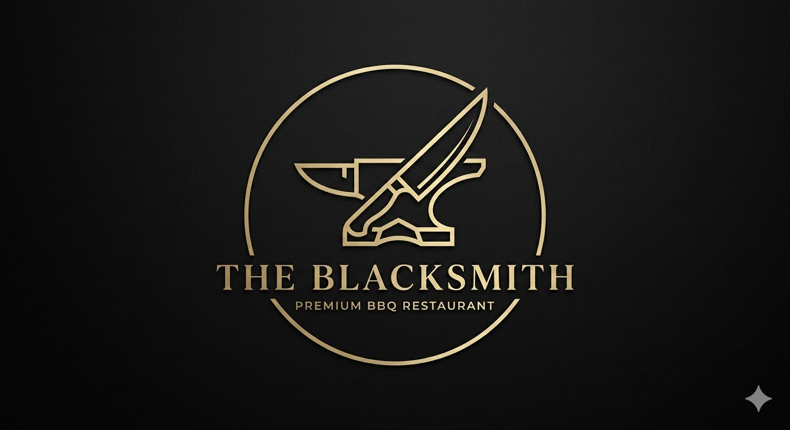

# ⚒️ The Blacksmith - Premium BBQ Website

<div align="center">
  
  <br><br>
  <strong>A luxurious showcase for premium smoked meats and authentic BBQ artistry</strong>
</div>

## ✨ Key Features

- **3D Glassmorphism Navbar** - Cutting-edge visual design with multi-layered shadows, backdrop blur, and interactive depth effects
- **Fully Responsive** - Tailwind CSS powered, flawless across all devices
- **AI-Generated Premium Assets** - High-fidelity imagery created with advanced AI tools
- **Smooth Animations** - Fade-in sections, hover transforms, and buttery scroll behavior
- **Production Ready** - Optimized, semantic HTML5 with hardware acceleration

## 📁 Local Assets Directory (Essential Files)

```
Gemini_Generated_Image_y7mhnby7mhnby7mh.png          # Main logo
Food---Lamb-2-web.jpg                               # Special cuts hero image
./www.instagram.com/
├── 486282319_17928568821029231_2927348845105163834_n.jpg
├── 485983966_17928359292029231_3938593221302549886_n.jpg
├── 487170038_17928675414029231_5991511026636800492_n.jpg
├── 488039233_17929427421029231_6139668421526721922_n.jpg
├── 489505155_17929845198029231_5458693852117730189_n.jpg
├── 491413354_17930494137029231_6442483193929234781_n.jpg
├── 491432695_17931055011029231_1287126242397123258_n.jpg  # Atmosphere hero
└── [20+ more atmosphere & menu images...]
```

## 🛠️ Tech Stack


 


**Typography:** Playfair Display (Headings) + Inter (Body)

## 📞 Real Contact Information

| **Contact** | **Details** |
|-------------|-------------|
| 📱 **Phone 1** | [+212 8 08 60 04 01](tel:+212808600401) |
| 📱 **Phone 2** | [+212 6 66 54 09 76](tel:+212666540976) |
| 💬 **WhatsApp** | [Message Now](https://wa.me/212808600401) |
| 📸 **Instagram** | [@theblacksmi.th](https://instagram.com/theblacksmi.th) |
| 📍 **Location** | Casablanca, Morocco |

## 🚀 Quick Setup

1. **Clone/Open Project**
   ```
   Open in VS Code or any code editor
   ```

2. **Live Server (Recommended)**
   ```
   Install VS Code Live Server extension
   Right-click index.html → "Open with Live Server"
   ```

3. **Direct Browser**
   ```
   Double-click index.html or drag to browser
   ```

### Development Commands
```bash
# Preview changes live
start index.html

# VS Code Live Server (port 5500)
# Automatically updates on save
```

## 🎨 Design Philosophy

**Luxury meets craftsmanship** - The design reflects premium BBQ artistry through:
- Industrial 3D aesthetics with metallic depth
- Gold accent lighting for premium feel
- Smooth, confident animations
- High-fidelity imagery showcasing perfect cuts

---

<div align="center">
  <em>Built with ❤️ for The Blacksmith - Where meat meets mastery</em>
  <br><br>
  
</div>
